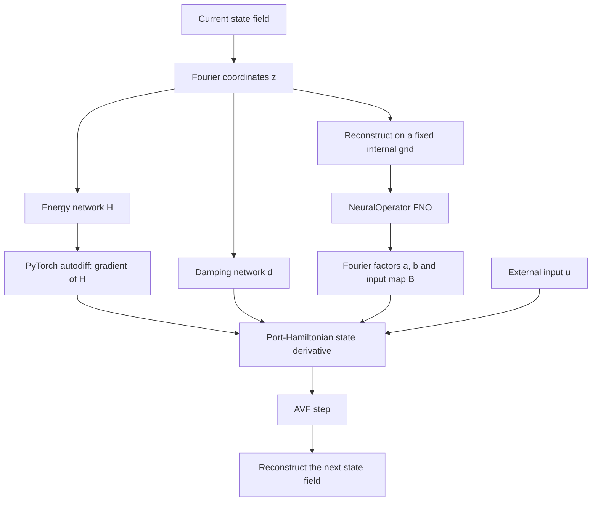

# Fourier port-Hamiltonian model

This implementation learns how a spatial field changes over time. It combines
an FNO from [NeuralOperator](https://github.com/neuraloperator/neuraloperator)
with a small PyTorch model that separates energy, dissipation, and external input.

Start with [the assembly notebook](ipynb/assemble_phfno.ipynb). It builds both
models, checks their basic properties, and runs a few training steps on synthetic
trajectories. The reusable code lives in `src/phfno/`.

<!-- Audit fix: describe the notebook's shared device choice and actual run configuration. -->
The [Navier–Stokes comparison notebook](ipynb/compare_phfno_fno.ipynb)
trains both models on generated noisy datasets using CUDA. Follow the setup below,
then run its cells in order to see learning curves, held-out rollouts, velocity
slices, and checks against the forcing, dissipation, and Navier–Stokes derivatives.
The [experiment guide](experiments.md) explains the split, metrics, and limitations.
The current comparison uses an implicit AVF step for both models, an explicit
Fourier-space Leray projection in the Navier–Stokes reference solver, and delayed
parameter updates after step 20. Set `theta_update_interval=10` in
`ComparisonConfig` for the ten-step variant.
The notebook generates missing data for the larger run: 32 trajectories per
flow type on a `24³` grid, with 41 snapshots each. It trains for 3,000 minibatch iterations
per model across three seeds, with `tqdm` progress bars and plots displayed inline.
The default accumulation schedule gives 616 Adam updates per run.
Training and evaluation helpers live in `src/experiments/`; checkpoints and
numerical results are saved under `results/local_smoke_test_seeds_8_18_28/`.

## Reproduce the notebook results

These steps start from a fresh checkout with **no dataset or checkpoint `.pt`
files**. You will generate the datasets, train both models, and use the checkpoints
you create for inference. Git includes notebooks and JSON summaries, but excludes
the generated `.pt` files; summaries alone cannot run inference.

The workflow covers the **time 0–1 AVF comparisons**. Run shell commands from the
repository root. You need Conda and an NVIDIA GPU with a CUDA-compatible driver
for the comparison notebooks; the small assembly demonstration also supports CPU.

### 1. Prepare the notebook kernel

Create a new environment and install the project and notebook tools:

```bash
conda create -n neuralpde python=3.11 pip -y
conda activate neuralpde
python -m pip install torch==2.11.0 --index-url https://download.pytorch.org/whl/cu128
python -m pip install -e '.[notebook,test]'
python -m pip install jupyterlab
python -m ipykernel install --user --name neuralpde --display-name 'Python (neuralPDE)'
python -c "import sys, torch; print(sys.executable, torch.__version__); assert torch.cuda.is_available(); print(torch.cuda.get_device_name(0))"
```

The final command must succeed and print your GPU name before proceeding. The
PyTorch command installs the CUDA 12.8 build used for the recorded runs; your
NVIDIA driver must support it. The project pins NeuralOperator to `2.0.0`.
Different hardware/software can still change floating-point results.

Open the repository in VS Code, or run `jupyter lab` from the repository root.
Select **Python (neuralPDE)** for each notebook, overriding any saved kernel
selection. Run cells from the top in the order described below.

### 2. Generate the comparison datasets

Generate all three flow families into a new directory:

```bash
PYTHONPATH=src python -m nsdata \
  --kind all --output-dir datasets/reproduce_avf \
  --grid-size 24 --trajectories 32 --snapshots 41 --final-time 1 \
  --viscosity 0.01 --initial-rms 0.2 \
  --forcing-amplitude 0.1 --forcing-frequency 1 \
  --cutoff 2 --max-dt 0.005 --noise-level 0.01 \
  --seed 142 --precision float64 --device cuda --threads 1
```

This writes `wave.pt`, `taylor_green.pt`, and `random.pt`, each with a JSON
metadata file. Each velocity tensor has shape `[32, 41, 3, 24, 24, 24]`.
The saved snapshot interval is **0.025**; `max-dt=0.005` controls the reference
solver's internal substeps. Forcing is held constant at each saved interval's
left-endpoint value. Generation uses float64 and stores float32 fields. The
initial-condition cutoff `2` is separate from the learned models' cutoff `7`.

The CLI refuses to overwrite existing `.pt` **or `.json`** files. Reuse existing
data when available, or choose another fresh directory. The velocity notebook
can also generate missing datasets with the same settings, including 1% noise.

For this fresh run, edit the following path assignments before running cells:

| Notebook | Variable or load path | Fresh-run value, relative to `root` |
|---|---|---|
| `compare_phfno_fno.ipynb` | `data_directory` | `datasets/reproduce_avf` |
| `compare_phfno_fno.ipynb` | `output` | `results/reproduce_velocity_avf` |
| `compare_vorticity.ipynb` | directory passed to `load_datasets` | `datasets/reproduce_avf` |
| `compare_vorticity.ipynb` | file loaded into `velocity_results` | `results/reproduce_velocity_avf/results.pt` |
| `compare_vorticity.ipynb` | `output` | `results/reproduce_vorticity_avf` |

For example: `data_directory = root / "datasets" / "reproduce_avf"`.

### 3. Train and save the models

1. Run [compare_phfno_fno.ipynb](ipynb/compare_phfno_fno.ipynb) completely.
   Its `run_comparison(...)` cell trains the velocity models, restores each
   validation-selected checkpoint, and evaluates autonomous held-out rollouts.
2. Run [compare_vorticity.ipynb](ipynb/compare_vorticity.ipynb) completely.
   It reads the completed velocity comparison, takes curls of the same data for
   vorticity training, and scores predictions in velocity space while retaining
   raw-vorticity diagnostics.

Both comparisons use trajectory indices **0–23 for training, 24–27 for validation,
and 28–31 for testing**, separately for each flow family. They train PHFNO and FNO
with seeds **8, 18, 28**, for **3,000 minibatch iterations / 616 Adam updates** per
model and seed. Training uses noisy transitions and a normalized Fourier H1 loss;
selection uses clean held-out one-step validation error.

Keep the notebook's shared AVF settings: four quadrature points, at most 100
iterations, `rtol=1e-4`, and `atol=1e-6`. Both CUDA matmul and cuDNN TF32 are
disabled. These settings are used for training, validation, and evaluation.
The full runs take substantial GPU time; progress bars report minibatch iterations.

Each comparison output directory contains:

- `PHFNO_{8,18,28}.pt` and `FNO_{8,18,28}.pt`: selected weights and configuration.
- `results.pt`: histories, predictions, reference fields, metrics, and failure records.
- `config.json` and `summary.json`: experiment provenance and readable statistics.
- The vorticity directory also contains `velocity_reference.json`.

Finish both notebooks before moving to inference. You should now have six model
checkpoints and a `results.pt` file in each of `results/reproduce_velocity_avf/`
and `results/reproduce_vorticity_avf/`. The plotting cells show learning curves,
held-out errors, energy curves, and physical diagnostics inline.

Later runs reuse completed results when data and configuration match. Choose new
output directories if you change either; cache checks reject mismatches.

To resume an interrupted vorticity comparison that has only partial results,
run this in place of its cached-results cell, after the setup cells:

```python
from experiments.vorticity_comparison import run_vorticity_comparison

vorticity_results = run_vorticity_comparison(
    datasets, config, output, velocity_reference=velocity_results,
)
```

Completed model/seed runs are reused. If training completed before evaluation was
interrupted, checkpoints containing `training_run` also preserve the selected
weights and training history. An interruption during training itself restarts
that unfinished model; optimizer state is not saved for mid-training continuation.

### 4. Run inference using your generated checkpoints

After completing step 3, restart either comparison notebook's kernel. Keep the
paths from step 2 and run only its setup/data/configuration cells, stopping before
the training/results cell. This defines `datasets`, `output`, and `device`.
In the velocity notebook, the `output = ...` assignment shares a cell with
`run_comparison(...)`: execute just that assignment, or copy it into your new
inference cell. Do not run the `run_comparison(...)` call for this step.

Execute the following in a new cell. It loads a checkpoint **you trained in step
3**; `output` selects the velocity or vorticity model directory:

```python
from dataclasses import replace
from experiments.comparison import ComparisonConfig, build_model
from experiments.metrics import evaluate_model
from experiments.vorticity_metrics import evaluate_vorticity_model

name, seed, family = "FNO", 8, "random"  # Also supports "PHFNO" and seeds 18/28.
checkpoint = torch.load(
    output / f"{name}_{seed}.pt", map_location="cpu", weights_only=True,
)
saved_config = replace(
    ComparisonConfig.from_record(checkpoint["config"]), device=device,
)
data = datasets[family]
model = build_model(checkpoint["model"], saved_config, data["clean"].shape[-3:])
model.load_state_dict(checkpoint["state_dict"], strict=True)
model.eval()

evaluator = (
    evaluate_vorticity_model
    if checkpoint.get("state_representation", "velocity") == "vorticity"
    else evaluate_model
)
with torch.no_grad():
    metrics = evaluator(
        model, data, saved_config.test_indices, device=device,
        method=saved_config.integration_method,
        solver_options=saved_config.solver_options,
        record_failures=True,
    )

fig, ax = plt.subplots()
for row, index in enumerate(saved_config.test_indices):
    ax.plot(metrics["times"], metrics["nrmse_time"][row], label=f"Trajectory {index}")
for failure in metrics.get("failures", []):
    ax.axvline(failure["time"], color="black", linestyle=":")
ax.set(xlabel="Time", ylabel="Velocity RMSE / initial velocity RMS")
ax.set_xlim(float(metrics["times"][0]), float(metrics["times"][-1]))
ax.legend()
plt.show()
print("AVF rollout failures:", metrics.get("failures", []))
```

This performs inference and computes diagnostics; it never calls an optimizer.
Each rollout starts from the clean initial state, feeds predictions into subsequent
steps, and supplies the saved piecewise-constant controls throughout. The reference
trajectory is used for scoring, not for resetting predictions. Returned metrics
are CPU tensors; `prediction` has shape `[4, 41, 3, 24, 24, 24]`. For vorticity
models it is reconstructed velocity; `vorticity_prediction` retains the raw output.

Always forward the saved integration method and solver settings: public PHFNO and
FNO rollout defaults differ. Use `torch.no_grad()`, not `torch.inference_mode()`,
because PHFNO still needs local energy derivatives during inference. Recognized
solver failures leave missing tails as NaN and are listed in `failures`.

### Other notebooks and interpretation

- [assemble_phfno.ipynb](ipynb/assemble_phfno.ipynb) is an optional interface demo:
  it generates its own small analytic example and performs three Euler/MSE updates.
  It does not produce the 3D comparison checkpoints.
- [dataset.ipynb](ipynb/dataset.ipynb) inspects reference data. For its original
  small example, generate data with
  `PYTHONPATH=src python -m nsdata --kind all --output-dir datasets/demo --device cuda`
  and change its first-cell load path from `root / "datasets"` to
  `root / "datasets" / "demo"`. Its original resolution labels assume a `16³` grid.
- [compare_long_rollout.ipynb](ipynb/compare_long_rollout.ipynb) is a separate
  time-20 evaluation. Before using it for a fresh experiment, point `dataset_dir`
  and **both** `checkpoint_dirs` at that experiment's matching data and model runs,
  choose a new output directory, and use the same TF32 settings as above. Its
  current paths include historical artifacts; they should not be mixed with a
  new comparison. It generates 801 new reference snapshots, not a stretched time axis.

Read the failure records as well as the error and energy plots. The recorded
time-1 velocity-trained mean final errors are **0.174 for PHFNO** and **0.099 for
FNO**, averaged over the three families and seeds. Two vorticity-trained PHFNO
rollouts fail their AVF solves; their missing values are not omitted from aggregate
statistics. Low divergence after inverse-curl reconstruction does not establish
raw-vorticity consistency. These results do not establish PHFNO superiority or
time-20 accuracy for the newly generated checkpoints.

## How the pieces fit together



A rollout repeats this process, using each predicted state as the next input.

### Represent the field with Fourier coordinates

The model works on a uniform periodic grid. Instead of evolving every grid value
independently, it keeps a chosen set of Fourier frequencies and packs their real
and imaginary parts into a real vector, called `z`.

$$
z = E_N v, \qquad v_N = E_N^{-1}z.
$$

`encode` converts a field to these coordinates, dropping frequencies outside the
cutoff. `decode` reconstructs the retained field on a requested grid. Every grid
side must contain at least `2 * cutoff + 1` points, without duplicating the
periodic endpoint.

The normalization preserves the field's squared size:

$$
\|z\|^2 = \frac{1}{K}\sum_x\sum_c |v_{N,c}(x)|^2.
$$

Here, `K` is the number of spatial points. This matters because it lets us use
ordinary coordinate gradients without an extra grid-size correction.

### Learn the energy and the operator factors

Two small PyTorch networks read `z`. One returns the scalar energy `H`; the other
returns a damping value `d`.

The FNO reads the reconstructed field and produces output fields for `a`, `b`,
and each column of the input map `B`. These outputs are converted back to Fourier
coordinates. The FNO supplies the lifting, spectral layers, and output projection;
there are no custom kernels.

The FNO always runs on `parameter_grid`, which is fixed when the model is built.
This lets the same coordinate dynamics be evaluated on different external grids.
Changing the Fourier cutoff requires a new model because it changes the size of
`z` and the scalar networks.

### Build the state derivative

PyTorch autodiff computes the energy gradient:

$$
e(z) = \nabla_z H(z).
$$

The learned factors then define the energy-exchange and damping terms:

$$
J(z)e = \frac12\left[a(z)\bigl(b(z)^Te\bigr)
                         -b(z)\bigl(a(z)^Te\bigr)\right],
\qquad R(z)e = d(z)^2e.
$$

The full update direction is

$$
\dot z = \bigl(J(z)-R(z)\bigr)e(z) + B(z)u.
$$

The code applies `J` using two dot products rather than building a large matrix.
Its skew symmetry prevents it from adding energy. Squaring `d` makes the damping
nonnegative. The input `u` can add or remove energy through `B`.

With the corresponding output `y`, the continuous model satisfies

$$
y = B(z)^Te(z), \qquad
\frac{dH}{dt} = -d(z)^2\|e(z)\|^2 + y^Tu.
$$

This identity concerns the learned energy. It does not establish that the network
has recovered the physical energy of a particular system. The two-factor form
also limits `J` to rank at most two, which may restrict what the model can learn.

### Take time steps and train

<!-- Audit fix: AVF integrates along the unknown endpoint segment; the old equation was Euler. -->
The comparison explicitly uses the same implicit AVF step for training, validation,
and held-out evaluation:

$$
z_{j+1} = z_j + \Delta t_j\int_0^1
f_\theta((1-\xi)z_j+\xi z_{j+1},u_j)\,d\xi.
$$

Autodiff remains active through the energy gradient during training. A prediction
loss can therefore update the energy network, the damping network, and the FNO,
including across several rollout steps.

<!-- Audit fix: distinguish public defaults and the continuous identity from a discrete guarantee. -->
Public `PHFNO.step` and `rollout` calls default to the implemented Gonzalez
discrete-gradient method; `FNOBaseline` defaults to Euler. Pass `method="avf"`
to select AVF explicitly. The AVF line integral uses numerical quadrature, and
PhFNO's structure matrices depend on the intermediate state. Therefore AVF does
not guarantee exact learned-energy preservation, dissipation, or passivity for
this architecture. The assembly notebook uses Euler and MSE as a small interface
demonstration; the comparison trains with a normalized Fourier H1 loss.

## The FNO comparison model

`FNOBaseline` uses an ordinary FNO to predict the state derivative. It broadcasts
the control values across the spatial grid and projects the output into the same
retained Fourier space. Both models expose the same interface:

| Call | Result |
|---|---|
| `model(field, control)` | State derivative on the input grid |
| `model.step(field, control, dt)` | Next state after the selected integration step |
| `model.rollout(initial, controls, times)` | Full predicted trajectory, including the initial state |

Fields have shape `[batch, channels, *grid]`. A control has shape
`[batch, control_channels]`; rollout controls have shape
`[batch, len(times)-1, control_channels]`. Passing `None` supplies zero controls.
Both models project the initial field into the retained Fourier space.

The baseline evaluates its FNO on the external grid. Matching its width and depth
with the structured model does not match parameter counts or computation cost.
The assembly notebook demonstrates the interface. The separate comparison
notebook measures both models on the same data and reports their different costs.

## Where to find the code

| File | Responsibility |
|---|---|
| [fourier.py](src/phfno/fourier.py) | Fourier coordinates and field reconstruction |
| [model.py](src/phfno/model.py) | Learned energy, damping, factors, and structured dynamics |
| [integrators.py](src/phfno/integrators.py) | Autodiff energy gradient, AVF, Euler, and Gonzalez steps |
| [baseline.py](src/phfno/baseline.py) | FNO comparison model |
| [assembly notebook](ipynb/assemble_phfno.ipynb) | Worked example and short training loop |
| [tests/](tests/) | Small checks of the mathematics and gradient flow |

## Run the tests

After installing the project as described above, activate your environment and
run the tests from the repository root:

```bash
conda activate neuralpde
OMP_NUM_THREADS=1 MKL_NUM_THREADS=1 python -m pytest -q
```

Use float32 for the FNO. During evaluation, use `model.eval()` with
`torch.no_grad()`. The energy gradient is computed locally inside that context;
`torch.inference_mode()` disables the differentiation it needs.

The tests cover Fourier normalization, projection, multidimensional inputs,
energy identities, gradients through every network, and short rollouts. They
also check the synthetic flow generators, prescribed forcing, viscous terms,
observation noise, and saved data. The experiment tests check trajectory splits,
checkpoint selection, training, physical diagnostics, and plotting.

## Synthetic 3D flow data

The `nsdata` package generates exact forced waves, Taylor–Green flows, and random
smooth divergence-free flows on the unit periodic cube. The datasets contain
clean and noisy velocities, scalar controls, external forcing, viscous terms,
and energy diagnostics. The [dataset guide](datasets/README.md) describes the
equations, tensor shapes, and generation options.

```bash
PYTHONPATH=src python -m nsdata --kind all --output-dir datasets/demo --device cuda
```

By default, this creates four trajectories per kind on a `16³` grid, with 21
snapshots over times zero to one. Generation uses CUDA by default; pass
`--device cpu` for small CPU checks. Use three state channels and one
control channel when connecting these data to either model.
