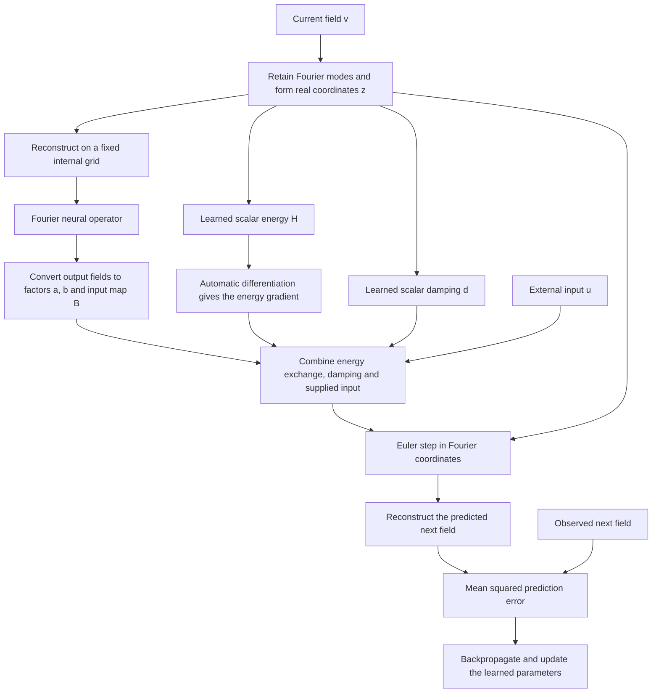

# A Fourier port-Hamiltonian model for controlled field dynamics

The construction combines a Fourier neural operator (FNO) with two small neural networks for energy and damping. The field is represented by a finite set of Fourier coordinates. PyTorch automatic differentiation computes the energy gradient, and the learned operators turn that gradient into a state derivative. An explicit Euler step advances the state in time.

## 1. Overview of the procedure

During one-step training, each input is an observed field. During prediction over several steps, each predicted field becomes the input to the next step.

## 2. Represent the field with real Fourier coordinates

Consider a real field with several state channels on a periodic domain:

$$
\begin{aligned}
\Omega & = (\mathbb R/\mathbb Z)^s, \\
v & : \Omega\longrightarrow\mathbb R^{c_v}.
\end{aligned}
$$

Choose a frequency cutoff along each spatial axis. The retained frequencies and the fields they can represent are

$$
\Lambda_N=\{k\in\mathbb Z^s: |k_i|\le N_i\},
$$

$$
\begin{aligned}
X_N=\{&\sum_{k\in\Lambda_N}\widehat{v}(k)e^{2\pi i k\cdot x}: \\&\widehat{v}(k)\in\mathbb{C}^{c_v}, \\&\widehat{v}(-k)=\overline{\widehat{v}(k)}\}.
\end{aligned}
$$

The conjugate-pair condition ensures that the reconstructed field is real. Only one coefficient from each nonzero pair needs to be stored. For each channel, place the zero coefficient first, followed by the real and imaginary parts of the retained representatives:

$$
\begin{aligned}
E_Nv=\mathrm{concat}_{c=1}^{c_v}[&\widehat{v}_c(0), \\&\{\sqrt{2}\mathrm{Re}\widehat{v}_c(k), \\&\qquad\sqrt{2}\mathrm{Im}\widehat{v}_c(k)\}_{k\in\Lambda_N^+}].
\end{aligned}
$$

One consistent choice is to keep frequencies whose first nonzero component is positive, ordered lexicographically. The resulting state is an ordinary real vector:

$$
\begin{aligned}
z & = E_Nv\in\mathbb R^D, \\
D & = c_v\prod_{i=1}^{s}(2N_i+1).
\end{aligned}
$$

A normalized fast Fourier transform computes the coefficients from a uniform grid. Its forward transform is divided by the number of spatial points. Together with the square-root-of-two factors, this preserves the field's inner product. For a retained field sampled on a sufficiently fine grid,

$$
\begin{aligned}
\|E_Nv\|_2^2 & = \int_\Omega\|v(x)\|_2^2\,dx \\
& = \frac1K\sum_{j=1}^{K}\sum_{c=1}^{c_v}|v_c(x_j)|^2, \\
v & \in X_N.
\end{aligned}
$$

Here, the channel contributions are summed and the spatial contributions are averaged. Each grid side must satisfy

$$
\begin{aligned}
n_i & \ge 2N_i+1, \\
K & = \prod_{i=1}^{s}n_i.
\end{aligned}
$$

The periodic endpoint is excluded. This also avoids placing a retained frequency at a Nyquist mode, where the usual conjugate-pair packing would need special treatment.

For a general sampled input, discard frequencies outside the cutoff before reconstructing the field. This defines the projection

$$
P_Nv=\sum_{k\in\Lambda_N}\widehat v(k)e^{2\pi i k\cdot x}.
$$

The cutoff sets the state dimension; the reconstruction grid can change without changing that dimension. Frequencies already aliased by the original sampling cannot be recovered by this projection.

## 3. Learn the energy and operator factors

The learned maps consist of one shared Fourier neural operator and two scalar networks. All three depend on the current state.

### Field-dependent factors

Reconstruct the state on a fixed internal grid, pass it through the Fourier neural operator, and divide its output into groups. Two groups supply the factors for internal energy exchange; the remaining groups supply one field per control channel. Convert each output group back into real Fourier coordinates:

$$
\begin{aligned}
&(a_\theta(z),b_\theta(z), \\
&\qquad B_{\theta,1}(z),\ldots,B_{\theta,m}(z)) \\
&\quad=E_N\,\mathrm{FNO}_\theta(E_N^{-1}z).
\end{aligned}
$$

The transforms in this expression are evaluated on the fixed internal grid, and the output transform acts separately on each group. The resulting dimensions are

$$
\begin{aligned}
a_\theta(z),b_\theta(z) & \in \mathbb R^D, \\
B_\theta(z) & \in \mathbb R^{D\times m}.
\end{aligned}
$$

Thus, for each control channel, the input map contains one direction in the state space. The total number of output channels from the Fourier neural operator is

$$
c_{\mathrm{out}}=(2+m)c_v.
$$

The lifting, spectral layers, channel networks, and output projection use standard NeuralOperator components. The construction uses dense spectral weights and no positional embedding, with ordinary PyTorch operations throughout.

Keeping the internal grid fixed makes the learned factors functions of the same coordinate vector even when the external evaluation grid changes. The internal grid may be the smallest one that resolves the retained frequencies or a finer one. Changing it can change the learned map because nonlinear operations are evaluated on that grid.

### Scalar energy and damping

Two separate networks read the Fourier coordinates directly:

$$
\begin{aligned}
H_\theta(z) & = \mathrm{MLP}_H(z), \\
d_\theta(z) & = \mathrm{MLP}_d(z).
\end{aligned}
$$

Each network has two hidden layers with smooth SiLU activations and a scalar output. Smooth activations allow differentiation through the energy gradient during training.

The energy output has no additive bias. A constant offset in energy has no effect on the dynamics and cannot be identified from trajectory predictions alone. The damping output retains its bias.

The scalar networks have input dimensions set by the Fourier cutoff. A different cutoff therefore requires a new model, while a different grid for evaluating the same retained field does not.

## 4. Obtain the energy gradient by automatic differentiation

The energy gradient determines the direction on which the structured operators act. This quantity is also called the effort:

$$
e_\theta(z)=\nabla_zH_\theta(z).
$$

PyTorch computes it by differentiating the sum of the energies in a batch with respect to the batch of state coordinates. Since samples are independent, this returns the gradient for each sample separately.

During training, the derivative remains part of the computation graph. A prediction loss can then differentiate through the energy gradient, update the energy network, and propagate through several time steps. Evaluation also needs to compute the energy gradient, even when parameter gradients are not being accumulated.

Because the coordinate transform preserves the inner product, the field gradient is obtained by reconstructing the coordinate gradient:

$$
\begin{aligned}
\mathcal H_\theta(v) & = H_\theta(E_Nv), \\
\nabla_{X_N}\mathcal H_\theta(v) & = E_N^{-1}\nabla_zH_\theta(E_Nv).
\end{aligned}
$$

No extra factor involving the number of grid points is needed.

## 5. Form the port-Hamiltonian state derivative

The learned vectors define a rank-one operator and its skew-symmetric part:

$$
\begin{aligned}
S_\theta(z) & = a_\theta(z)b_\theta(z)^T, \\
J_\theta(z) & = \frac12[S_\theta(z)-S_\theta(z)^T].
\end{aligned}
$$

The damping operator is a squared scalar times the identity:

$$
\begin{aligned}
L_\theta(z) & = d_\theta(z)I, \\
R_\theta(z) & = L_\theta(z)^TL_\theta(z)=d_\theta(z)^2I.
\end{aligned}
$$

These operators can be applied directly to the effort:

$$
\begin{aligned}
J_\theta(z)e & = \frac{1}{2}a_\theta(z)(b_\theta(z)^Te) \\
&\quad-\frac{1}{2}b_\theta(z)(a_\theta(z)^Te), \\
R_\theta(z)e & = d_\theta(z)^2e.
\end{aligned}
$$

Only dot products and multiplication are needed; large state-by-state matrices are never formed. The factors vary nonlinearly with the state, while the operators act linearly on the effort at each fixed state.

Combining internal energy exchange, damping, and external forcing gives

$$
\begin{aligned}
\dot z & = f_\theta(z,u) \\
& = [J_\theta(z)-R_\theta(z)]e_\theta(z)+B_\theta(z)u.
\end{aligned}
$$

The corresponding port output is

$$
y=B_\theta(z)^Te_\theta(z).
$$

Skew symmetry makes the internal exchange term contribute zero power. Squaring the damping value guarantees a nonnegative dissipation term. Consequently, the continuous model satisfies

$$
\begin{aligned}
\frac{dH_\theta}{dt} & = e_\theta(z)^T\dot z \\
& = -d_\theta(z)^2\|e_\theta(z)\|^2+y^Tu.
\end{aligned}
$$

The final term measures power supplied through the input. With zero input, the learned energy cannot increase along the continuous dynamics.

This identity does not require the learned energy to be positive, and it does not establish that the network has recovered a system's physical energy. The chosen structure also imposes two restrictions: the skew operator has rank at most two, and damping acts with the same scalar strength in every coordinate direction.

## 6. Advance the state and train on observed transitions

Time integration uses explicit Euler, with each input held constant over its time interval:

$$
\begin{aligned}
z_{j+1} & = z_j+\Delta t_j f_\theta(z_j,u_j), \\
\widehat v_{j+1} & = E_N^{-1}z_{j+1}.
\end{aligned}
$$

Each step converts the current field to coordinates, evaluates the learned state derivative, advances the coordinates, and reconstructs the next field. Repeating this process produces a trajectory from the projected initial field. The time intervals may be nonuniform.

Training uses observed current fields, their controls, and the corresponding next fields. The mean squared prediction error is

$$
\begin{aligned}
\mathcal{L}(\theta)
&=\frac{1}{n_{\mathrm{pairs}}c_vK}
\sum_{r=1}^{n_{\mathrm{pairs}}}\sum_{c=1}^{c_v}\sum_{j=1}^{K} \\
&\qquad\times|\widehat{v}_{r,c}(x_j)-v^{\mathrm{target}}_{r,c}(x_j)|^2.
\end{aligned}
$$

This averages over training pairs, state channels, and spatial points. The training cycle is straightforward:

1. Select a batch of observed transitions and their inputs.
2. Predict each next field using the observed interval length.
3. Compute the mean squared error against the next-field targets.
4. Differentiate the loss through the update and the energy gradient.
5. Update the parameters of the field, energy, and damping networks together.

One-step training starts every prediction from an observation. A rollout instead feeds predictions back into the model, so errors can accumulate across time. Differentiation through a rollout is supported, although it uses more memory as the number of steps increases. Learning the input map requires data that exercises the control channels; zero-input trajectories alone cannot identify it.

Explicit Euler does not preserve the continuous energy balance exactly at a finite step size. Gonzalez discrete gradients could be considered later, together with a compatible time integrator, when a discrete energy balance is needed. They are not part of the present procedure: the energy gradient is obtained by automatic differentiation, and the state is advanced with Euler steps.

## 7. Compare with an unconstrained Fourier neural operator

A comparison model can predict the state derivative directly with an ordinary Fourier neural operator. Project the current field into the retained space, broadcast the controls across its grid, and concatenate them with the state. Project the predicted derivative back into the same Fourier space:

$$
\begin{aligned}
f_{\mathrm{FNO}}(v,u)
&=P_N\,\mathrm{FNO}_\phi( \\
&\qquad\mathrm{concat}[P_Nv,\mathrm{broadcast}(u)]).
\end{aligned}
$$

Both models use the same Euler update, control convention, and prediction loss. The unconstrained model evaluates its operator on the external grid; the structured model evaluates its factor-generating operator on a fixed internal grid. Matching widths and depths does not imply equal parameter counts or computational cost.

This comparison asks what changes when a learned vector field is given an explicit energy structure. It differs from training a Fourier neural operator to map an initial field directly to a distant final state.

## 8. Check the construction before evaluating performance [#TO DO]

The first checks concern the mathematics and differentiation. Fourier conversion should preserve the retained field and its norm. The internal exchange operator should be skew-symmetric, and damping should be nonnegative. The computed state derivative should satisfy the continuous power identity to numerical precision.

Gradient checks should confirm that a prediction loss reaches all three learned networks, the initial state, and the controls. Short trajectory checks establish that gradients pass through multiple time steps. Evaluating the same Fourier state on different supported grids should preserve the structured coordinate dynamics up to numerical precision.

These checks establish that the construction behaves as intended. Predictive accuracy, long-time stability, and comparisons at matched computational cost require separate experiments on suitable datasets.
